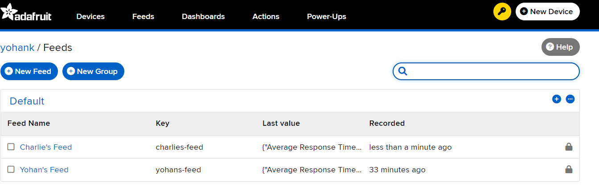
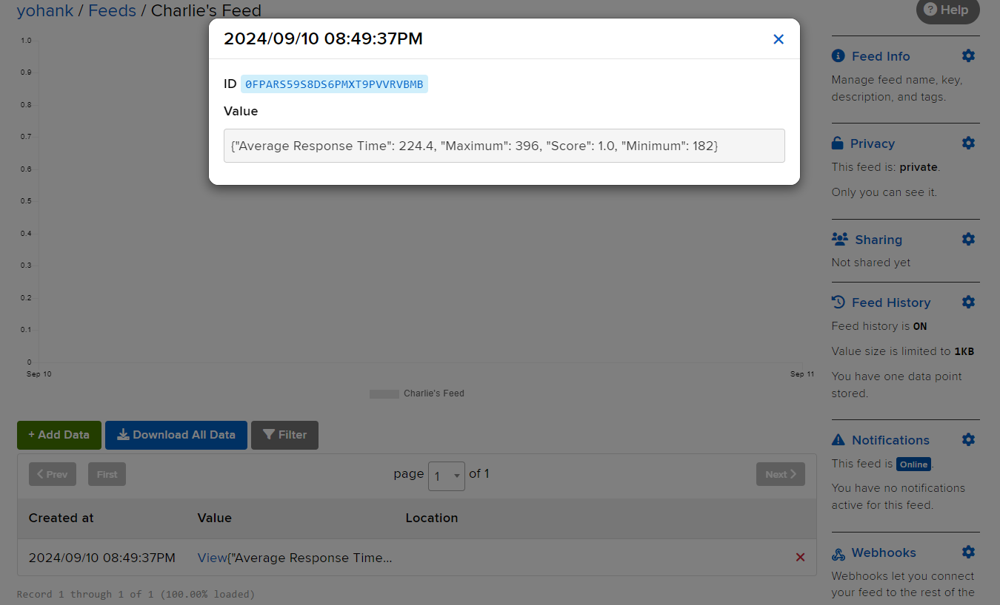
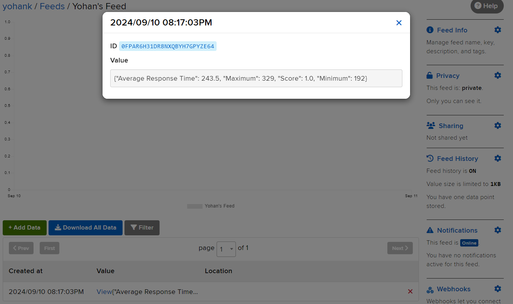

# Exercise 1

We found that `max_bright = 1000` and `min_bright = 40000` are the best values to make the LED bright in room light and dim in dark room.

# Exercise 2

We used the tones defined with frequency in [this example](https://www.coderdojotc.org/micropython/sound/04-play-scale/) to play a series of notes.

# Exercise 3
The unique code for this exercise can be found in exercise_game.py. The cloud service we used for this exercise was Adafruit IO. Adafruit IO utilizes a system called "Feeds," which allows for separate storage of different data streams. This feature enables us to upload our data to a specific feed, ensuring it remains organized and isolated from other data. Each feed acts as a designated container, where data is stored securely and can be accessed as needed.

Separate Feeds 

Inside Charlie's Feed with uploaded data

Inside Yohan's Feed with uploaded data

Example video of playing game data being uploaded to cloud service.

